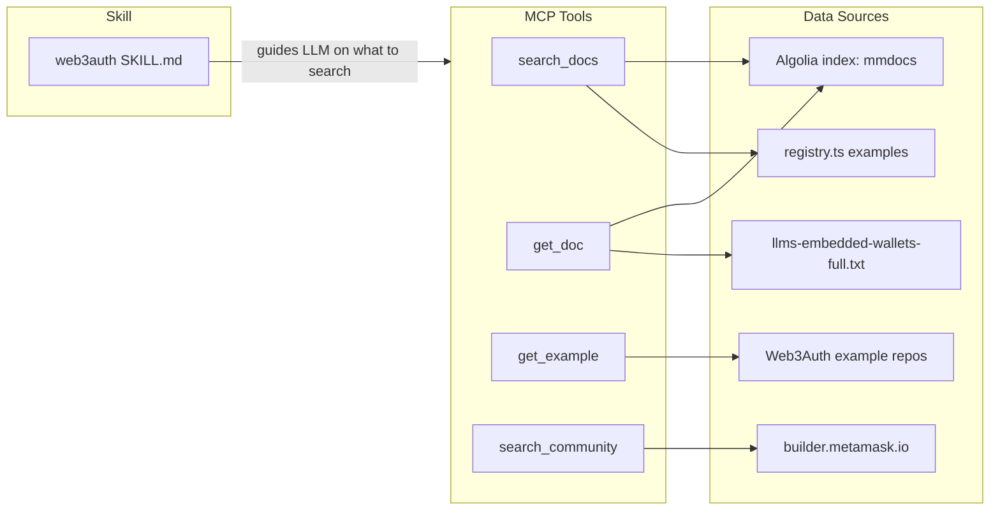

# Simplify MCP + Unify Skills

## Architecture

The MCP becomes a **data pipe** with no decision logic. The skill teaches the LLM **how to think**. The MCP gives it **what to reference**.

## Data Sources

### Algolia (docs search + content)

The docs.metamask.io site uses Algolia for search. Public credentials from `docusaurus.config.js`:

- App ID: `W4ZOZ72ZFG`
- Search API Key: `b4e925aa9bf05e5bef2e40b3ee6ee431` (public, read-only)
- Index: `mmdocs`

Algolia records are per-section (h1/h2/h3 level). Each record contains rendered content (imports resolved, no broken MDX), hierarchy breadcrumbs, and the page URL. We call the Algolia REST API directly from our MCP -- no need for the separate Algolia MCP server.

### llms.txt (full doc content, fallback)

The Docusaurus config includes `docusaurus-plugin-llms` which generates LLM-optimized files:

- `https://docs.metamask.io/llms-embedded-wallets.txt` -- links only
- `https://docs.metamask.io/llms-embedded-wallets-full.txt` -- full rendered content with imports resolved, duplicates removed

This is the fallback for getting complete page content when Algolia section-level results are not enough.

### Discourse (community, with API key)

builder.metamask.io is Discourse. The user will provide a read-only API key via env var `DISCOURSE_API_KEY` for full topic access with higher rate limits. Without the key, public endpoints still work.

- Search: `GET /search.json?q=<query> category:5`
- Topic: `GET /t/<id>.json`
- With auth: `Api-Key: <key>` + `Api-Username: <username>` headers

## MCP Tools (4 tools)

### 1. `search_docs`

Combines **Algolia doc search** with **registry example search**.

- Input: `query` (string), optional `platform`, `chain`, `category` filters
- Doc search: POST to `https://W4ZOZ72ZFG-dsn.algolia.net/1/indexes/mmdocs/query` with the query. Filter results to embedded-wallets section. Returns titles, URLs, content snippets, and hierarchy breadcrumbs.
- Example search: Use existing `findExamples()` from [registry.ts](src/content/registry.ts) with optional platform/chain/category filters.
- Output: combined list of doc results and matching examples with names, URLs, descriptions.

### 2. `get_doc`

Fetches **full doc page content** for a given URL. Three-tier fallback chain:

- Input: `url` (a docs.metamask.io URL)
- **Tier 1 -- Algolia**: Search for all records matching that URL, concatenate by hierarchy order to reconstruct the full page. Gives rendered content with imports resolved.
- **Tier 2 -- llms.txt**: Fetch `https://docs.metamask.io/llms-embedded-wallets-full.txt`, find the section matching the URL, extract it.
- **Tier 3 -- GitHub raw MDX**: Map the URL to the `MetaMask/metamask-docs` repo path (e.g. `docs.metamask.io/embedded-wallets/sdk/react/` -> `embedded-wallets/sdk/react/`). Use GitHub Contents API to find the `.mdx` file, fetch via `raw.githubusercontent.com`. MDX may have unresolved imports but still contains the prose and code blocks.
- Output: the full markdown content of that doc page. Each tier is tried in order; first success wins.

### 3. `get_example`

Fetches **all source files** from an example project.

- Input: example name or repo/owner/path from registry search results
- Process:
  1. Use GitHub Contents API to recursively list all files in the example directory
  2. Fetch every source file via `raw.githubusercontent.com`
  3. Skip: `package-lock.json`, `yarn.lock`, `.gitignore`, binary files (`.png`, `.jpg`, `.svg`, `.ico`, `.gif`, `.woff`, `.ttf`), `node_modules`
  4. Include everything else: `.ts`, `.tsx`, `.js`, `.jsx`, `.json`, `.html`, `.css`, `.swift`, `.kt`, `.dart`, `.cs`, `.cpp`, `.xml`, `.yaml`, `.toml`, `.gradle`, `.md`, `.mdx`, `.plist`, `.env.example`, config files
- Output: structured result with file path and full content for each file

### 4. `search_community`

Search and fetch from builder.metamask.io Discourse forum.

- **Search mode**: `query` param. Returns topic titles, URLs, blurbs, reply counts, view counts.
- **Fetch mode**: `topic_id` param. Returns full topic: title, all posts with HTML content, author info, timestamps, reply chains.
- Auth: Uses `DISCOURSE_API_KEY` env var when available for full access. Falls back to public API.

### Removed tools

- `**recommend_sdk`** -- Decision logic moves to skill. Delete `src/tools/recommend-sdk.ts`.
- `**troubleshoot`** -- LLM reasons from skill + `search_community` + `get_doc`. Delete `src/tools/troubleshoot.ts`.
- `**get_integration_guide`** -- Split into `get_doc` + `get_example`. Delete `src/tools/get-integration-guide.ts`.

## Content files

- **[src/content/platform-matrix.ts](src/content/platform-matrix.ts)** -- **Keep fully intact.** Types, `PLATFORM_MATRIX` data, and `getPlatformRecommendation()` all stay.
- **[src/content/registry.ts](src/content/registry.ts)** -- **Keep fully intact.** Example registry and `findExamples()` are critical for `search_docs` and `get_example`. Doc registry entries become secondary to Algolia but kept as fallback.
- **[src/fetcher/cache.ts](src/fetcher/cache.ts)** -- Keep.

## Fetcher changes

- **Delete `src/fetcher/docs-fetcher.ts`** -- Replaced by Algolia fetcher. HTML scraping with cheerio is no longer needed.
- **New: `src/fetcher/algolia-fetcher.ts`** -- Algolia REST API client. `searchAlgolia(query, filters?)` for search, `fetchDocPage(url)` for full page reconstruction from Algolia records. Falls back to llms.txt, then to GitHub raw MDX from `MetaMask/metamask-docs`.
- **Modify: `src/fetcher/github-fetcher.ts`** -- Add `fetchExampleFull(owner, repo, path)` that recursively lists and fetches all source files.
- **New: `src/fetcher/community-fetcher.ts`** -- Discourse API client with optional API key auth.

## Skill: One Unified `web3auth` Skill

Replace all 11 platform-specific skills with `skills/web3auth/SKILL.md`.

### Skill structure

1. **Header**: trigger conditions (web3auth, embedded wallets, MetaMask embedded, social login wallets, wallet connection, etc.)
2. **Product Overview**: what MetaMask Embedded Wallets are, SSS architecture, non-custodial model (~10 lines)
3. **MCP Usage Guide**: when to call each tool:
  - User asks "which SDK?" -> use platform matrix below, then `search_docs` to find the SDK doc + `get_example` for a quick-start
  - User asks about integration -> `search_docs` for the relevant doc pages + `get_example` for the matching example
  - User hits an error -> `search_community` for the error message, `get_doc` for troubleshooting pages
  - User asks about a feature -> `search_docs` by feature keyword
4. **Platform Capability Matrix**: the FULL table from [platform-matrix.ts](src/content/platform-matrix.ts) -- every platform with every capability and notes.
5. **SDK Recommendation Logic**: the FULL logic from `getPlatformRecommendation()` as decision rules.
6. **Key Derivation Rules**: CRITICAL section.
7. **Authentication Concepts**: connections, grouped connections, custom JWT.
8. **Common Misunderstandings**: consolidated from all 11 skills, deduplicated (~15 entries).
9. **Platform Quick Reference**: 3-5 lines per platform for critical gotchas not in docs.

## File Changes Summary

### New files

- `src/fetcher/algolia-fetcher.ts` -- Algolia REST API client
- `src/fetcher/community-fetcher.ts` -- Discourse API client
- `src/tools/get-doc.ts` -- fetch doc page content via Algolia + llms.txt fallback
- `src/tools/get-example.ts` -- recursively fetch all source files from an example
- `src/tools/search-community.ts` -- Discourse search + topic fetch
- `skills/web3auth/SKILL.md` -- unified skill

### Modified files

- `src/tools/search-docs.ts` -- rewrite to combine Algolia search with registry example search
- `src/fetcher/github-fetcher.ts` -- add `fetchExampleFull()` for recursive file fetching
- `src/index.ts` -- register new 4 tools, remove old 4
- `app/api/mcp/route.ts` -- same tool changes
- `package.json` -- remove `cheerio` dependency, add env var documentation

### Deleted files

- `src/tools/recommend-sdk.ts`
- `src/tools/troubleshoot.ts`
- `src/tools/get-integration-guide.ts`
- `src/fetcher/docs-fetcher.ts` -- replaced by algolia-fetcher.ts
- All 11 `skills/metamask-embedded-*/` folders

### Unchanged

- `src/content/platform-matrix.ts` -- fully intact
- `src/content/registry.ts` -- fully intact
- `src/fetcher/cache.ts` -- unchanged

## Environment Variables

Already configured in `.env`:

- `DISCOURSE_API_KEY` -- read-only Discourse API key for builder.metamask.io (already set)

Algolia credentials are hardcoded (they are public search-only keys, same as what is embedded in the docs site's client-side JavaScript).

The `DISCOURSE_API_USERNAME` is not strictly needed for read-only API key auth on Discourse; the key alone is sufficient for public category access.