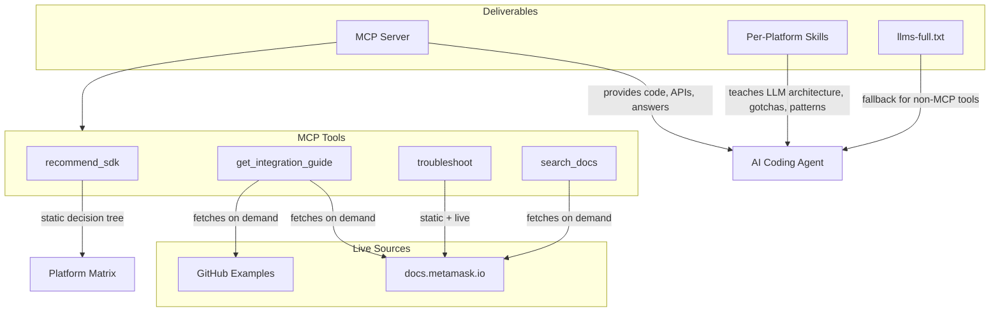

# MetaMask Embedded Wallets MCP Server

## Architecture Overview

Three deliverables, each serving a different role:




**Skills** (rarely change) teach the LLM *how to think* about each SDK -- architecture, framework quirks, common misunderstandings. They contain zero code or package names.

**MCP Tools** (logic rarely changes) provide *live content* -- fetching current docs and examples on demand so code is never stale.

**llms-full.txt** (auto-generated) is a fallback for tools that don't support MCP.

---

## Project Structure

```
web3auth-mcp/
  package.json
  tsconfig.json
  README.md
  src/
    index.ts                  # Entry: stdio + streamable HTTP transport
    tools/
      recommend-sdk.ts        # SDK selection wizard
      get-integration-guide.ts # Fetch docs + examples for a specific SDK
      troubleshoot.ts         # Diagnose issues from error/symptom
      search-docs.ts          # General doc search
    content/
      registry.ts             # Curated URL map: topic -> doc URL + GitHub example URL
      platform-matrix.ts      # Platform capability matrix (static)
    fetcher/
      docs-fetcher.ts         # Fetch + parse docs.metamask.io pages to markdown
      github-fetcher.ts       # Fetch raw files from GitHub example repos
      cache.ts                # In-memory LRU cache with configurable TTL
  skills/
    metamask-embedded-react/SKILL.md
    metamask-embedded-vue/SKILL.md
    metamask-embedded-js/SKILL.md
    metamask-embedded-react-native/SKILL.md
    metamask-embedded-android/SKILL.md
    metamask-embedded-ios/SKILL.md
    metamask-embedded-flutter/SKILL.md
    metamask-embedded-unity/SKILL.md
    metamask-embedded-unreal/SKILL.md
    metamask-embedded-node/SKILL.md
    metamask-embedded-general/SKILL.md
  scripts/
    generate-llms-txt.ts      # Crawl docs + compile llms-full.txt
```

---

## MCP Tools Design

### 1. `recommend_sdk`

Solves the #1 issue: SDK confusion.

- **Input**: `platform` (web/react-native/android/ios/flutter/unity/unreal/node), `features` (social-login, external-wallets, smart-accounts, wallet-ui, etc.), `chain` (evm/solana/other)
- **Logic**: Static decision tree from `platform-matrix.ts`. No network calls needed.
- **Output**: Recommended SDK package, capabilities available on that platform, limitations, links to docs + quickstart example, and warnings (e.g., "external wallets only available on web", "no built-in provider on mobile -- you'll need to use the private key with a platform-specific library")

### 2. `get_integration_guide`

Solves the #4 issue: developers not finding/using examples.

- **Input**: `sdk` (react/vue/js/react-native/android/ios/flutter/unity/unreal/node), `feature` (optional: auth-setup, evm-transactions, solana-transactions, smart-accounts, wallet-ui, custom-auth, mfa, etc.)
- **Logic**: Looks up the relevant doc URL and GitHub example URL from `registry.ts`. Fetches both live. Combines them into a structured response.
- **Output**: Step-by-step guide with live code from docs, link to full working example, and relevant dashboard setup steps.

### 3. `troubleshoot`

Solves issues #2, #3, #5, #6, #7.

- **Input**: `error_message` or `symptom` (free text), `sdk` (optional), `platform` (optional)
- **Logic**: Pattern matches against known issues:
  - Private key mismatch -> different-private-key guide
  - JWT/auth errors -> jwt-errors guide
  - Polyfill/bundler errors -> platform-specific polyfill guide (Vite/Webpack/Metro/Nuxt/Svelte)
  - Popup blocked -> popup-blocked guide
  - Deep link / allowlist -> platform docs deep-linking section
  - Unknown -> suggests Builder Hub (`builder.metamask.io/c/embedded-wallets/5`)
- **Output**: Diagnosis, fix steps (fetched live from relevant troubleshooting page), and link to Builder Hub for human help if needed.

### 4. `search_docs`

General-purpose doc search.

- **Input**: `query` (free text)
- **Logic**: Searches the curated registry by keyword/topic. Fetches matching pages. Returns relevant sections.
- **Output**: Matching doc sections with content and links.

---

## Skills Design

Each skill follows Dynamic's proven pattern: YAML frontmatter + structured markdown. Skills contain **zero code or package names** -- the LLM looks those up via MCP or docs.

### Skill structure (example for React):

```markdown
---
name: metamask-embedded-react
description: Integrate MetaMask Embedded Wallets (Web3Auth) React SDK...
---

# MetaMask Embedded Wallets - React SDK

## Architecture
- Provider-based: Web3AuthProvider wraps the app...
- Modal vs No-Modal: two integration modes...
- Built-in EVM/Solana providers...

## Framework Considerations
- Vite: needs buffer/process polyfills, define global...
- Next.js: use 'use client' for provider component...
- Webpack 5: deprecated CRA, polyfill config needed...

## Common Misunderstandings
- Different client IDs produce different wallet addresses...
- Sapphire Devnet vs Mainnet: devnet allows localhost, mainnet does not...
- Popup blocked: minimize delay between user click and connectTo call...
- Wagmi integration: use dedicated Web3Auth Wagmi hooks...

## Patterns
- Always initialize SDK before calling connectTo...
- Use session management for persistent login...
```

### `metamask-embedded-general` skill covers:

- Product overview (what Embedded Wallets is, SSS, non-custodial)
- Dashboard setup flow (project creation, client ID, allowlist, chains, auth)
- Custom authentication concepts (connections, grouped connections, JWKS, JWT validation)
- Key derivation rules (same connection + same client ID + same network = same key)
- Feature availability matrix across platforms
- When to recommend Builder Hub for human support

---

## Scalability: The Monthly Update Process

When a product update ships, the update touches at most 3 types of files:


| What changed                             | Files to update                  | Frequency         |
| ---------------------------------------- | -------------------------------- | ----------------- |
| SDK architecture, new platform quirks    | Relevant `skills/*.md`           | Rare (~quarterly) |
| New doc pages, URL restructuring         | `src/content/registry.ts`        | Occasional        |
| New platform capabilities                | `src/content/platform-matrix.ts` | Occasional        |
| New feature category for tools           | `src/tools/*.ts`                 | Very rare         |
| Doc content (code examples, API details) | Nothing -- live fetch handles it | Automatic         |


**The concrete workflow:**

1. You tell me: "We shipped SDK v11. Feature X was added to React Native. We deprecated Y. New doc page at Z."
2. I update the affected skill file(s) -- architecture section if behavior changed, common misunderstandings if new gotchas.
3. I update `registry.ts` if new URLs were added.
4. I update `platform-matrix.ts` if capabilities changed.
5. I do NOT need to update any code examples -- they're fetched live from docs.metamask.io.
6. You rebuild (`npm run build`) and republish.

**Why this is scalable:**

- Skills are isolated per-platform. Changing one SDK never touches another skill.
- The registry is a flat map of `topic -> URL`. Adding a page is one line.
- The platform matrix is a structured object. Adding a capability is one field.
- Tool logic is generic (fetch, parse, return). It almost never changes.
- Live fetching means 90% of content updates require zero code changes.

---

## Transport and Distribution

- **npm package**: `npx @web3auth/mcp-server` runs via stdio transport for local use
- **Remote URL**: Streamable HTTP transport at a hosted endpoint (e.g., `https://mcp.web3auth.io`) for tools like Cursor that support remote MCP
- Both transports share the same tool implementations; only the transport layer differs

---

## Key Dependencies

- `@modelcontextprotocol/sdk` -- MCP server SDK
- `node-fetch` or native fetch -- for live doc fetching
- `cheerio` or `linkedom` -- for parsing HTML docs into clean text
- `lru-cache` -- for in-memory caching with TTL

---

## What This Beats vs Competitors

- **vs Privy** (raw doc dump via llms-full.txt): We have structured tools that answer specific questions (SDK selection, troubleshooting) instead of dumping 100k tokens of raw docs. Our skills teach the LLM to think correctly before it even reads code.
- **vs Dynamic** (MCP search + skills): We add an SDK recommendation tool (they don't need one -- simpler product), a troubleshooting tool (they don't have one), and GitHub example fetching (code, not just docs). Our skills also encode the complex cross-platform capability matrix that Dynamic doesn't deal with.

